# IPO Evidence Intelligence

IPO Evidence Intelligence is a local-first research system for IPO prospectuses. It turns long, messy PDF filings into structured evidence, LLM-assisted analysis, readable research reports, and a browser reader where every key claim can be checked through clickable citations.

Public demo:

```text
https://pluto-mo.github.io/first-signal/
```

The GitHub Pages site is a static showcase only. It publishes finished reports and clickable citation bundles, not the full local `data/` directory, raw PDFs, OCR output, blocks, tables, or evidence packets.

## Why This Exists

IPO prospectuses are hundreds of pages long. They contain business descriptions, industry context, customers, suppliers, financial tables, fundraising projects, risks, and dense legal language. A direct "summarize this PDF" workflow tends to lose page-level traceability and can produce confident-looking claims that are hard to verify.

This project takes a different route:

- Parse the PDF into long-lived document assets.
- Extract evidence with local source positions.
- Convert evidence into structured analytical signals through Skills.
- Rewrite the analysis through configurable writing layers.
- Publish a reader where citations can be clicked and checked.

It is designed for learning, research, and document intelligence experiments. It is not investment advice, legal advice, audit work, or a trading recommendation engine.

## Current Architecture

```mermaid
flowchart LR
  A["IPO filings<br/>CNInfo or local PDF"] --> B["Source sync<br/>discover / filter / download / archive"]
  B --> C["PDF inbox"]
  C --> D["Document ingest<br/>doc_id / manifest"]
  D --> E["PDF parsing<br/>Markdown / blocks / tables"]
  E --> F["Section mapping<br/>source AST / canonical AST"]
  F --> G["Evidence layer<br/>evidence packet / citations"]
  G --> H["Report runtime inputs<br/>profile / report inputs"]
  H --> I["Skills layer<br/>analytical intermediate outputs"]
  I --> J["Draft rewrite layer<br/>section writer / stitch writer"]
  J --> K["Narrative rewrite layer<br/>narrative engine / prompt"]
  K --> L["Reader assets<br/>report / reader bundle / web index"]
  L --> M["Web reader<br/>tree / grouping / citation drawer"]
  L --> N["GitHub Pages showcase<br/>report + clickable citations"]
```



## The Evidence-First Design

The system does not ask an LLM to freely summarize the whole PDF. It first converts each prospectus into reusable assets:

```text
document.md
blocks.jsonl
source_ast.json
canonical_ast.json
tables/*.json
evidence_packet.json
citation.json
report.md
reader_bundle.json
```

The report is the final expression, not the source of truth. Evidence and citations remain separate so the writing layer can be changed without losing traceability.

Text citations preserve local source fields such as `source_file`, `page_number`, `block_id`, `section_path`, and `quote`. Table citations preserve structured table identity, title, page number, fields, and section path.

## Skills Layer

The Skills layer is the analytical middle layer between evidence and writing. It turns raw evidence into structured interpretations that the writer can use.

Current high-value Skills include:

- `business_goal_decompose`: decomposes the company into business goals, revenue logic, and strategic intent.
- `capability_match`: connects products, technologies, customers, scenarios, and commercialization capability.
- `tension_expand`: expands the key tensions behind the growth story, such as dependence, competition, adoption risk, and execution constraints.
- `reader_value_translate`: translates evidence into the questions a serious reader would actually care about.

These Skills are LLM-backed but keep deterministic fallbacks. That makes the layer extensible without turning the whole pipeline into a fragile one-shot prompt.

The important point: Skills are customizable and pluggable. New analytical modules can be added for finance quality, fundraising projects, customer concentration, industry structure, risk factors, or cross-company comparison without rewriting the parser or the reader.

## Two Pluggable Rewrite Layers

The rewrite system is now split into two customizable layers:

```text
Skills outputs
  -> draft rewrite layer
  -> narrative rewrite layer
  -> final report
```

The draft rewrite layer is responsible for structure. It organizes evidence and Skills outputs into sections, draft paragraphs, and logical transitions while preserving citation discipline.

The narrative rewrite layer is responsible for final expression. It uses `narrative_engine.py` and `configs/prompts/narrative_writer.yaml` to turn the structured draft into a coherent research-style reading experience.

Both layers are designed to be swapped or tuned independently. You can change the report format, the narrative style, or the analytical frame without rebuilding the underlying document assets.

## Web Reader

The Vite + React reader supports:

- A document tree for multiple prospectuses.
- Time grouping based on official IPO publication date.
- Industry grouping.
- Company-name-only report titles.
- Clickable citation chips inside the report.
- A citation drawer showing quote, page, section path, and table location.

The GitHub Pages version uses a minimal showcase dataset under `web/showcase-data/`. This keeps the public demo lightweight and avoids exposing unrelated local research files.

## Local Usage

Install dependencies according to your local Python and Node environment, then run:

```bash
python -m ipo_evidence.cli sync-a-share --days 7 --limit 3
python -m ipo_evidence.cli scan-inbox
python -m ipo_evidence.cli generate-report --doc-id doc_beaac21be4b3
python -m ipo_evidence.cli build-web-index
```

Run the reader locally:

```bash
cd web
npm run dev
```

Build the static showcase:

```bash
cd web
npm run build:pages
```

Run checks:

```bash
pytest
cd web
npm test
npm run build:pages
```

## Repository Layout

```text
configs/
  prompts/
  skills/
  skill_packages/

src/ipo_evidence/
  source_sync/
  skill_executor.py
  narrative_engine.py
  web_index.py

data/
  inbox/
  docs/
  tmp/

web/
  src/
  showcase-data/
```

The `data/` directory is local working material. The public showcase only ships reader-ready report bundles.
