```mermaid
flowchart LR
  A["公告源 / 本地 PDF"] --> B["source_sync 抓取层<br/>发现 / 筛选 / 下载 / 留档"]
  B --> C["data/inbox<br/>PDF 输入池"]
  C --> D["文档接入<br/>doc_id / manifest"]
  D --> E["PDF 解析<br/>Markdown / blocks / tables"]
  E --> F["章节映射<br/>source_ast / canonical_ast"]
  F --> G["证据层<br/>evidence_packet / citation"]
  G --> H["报告运行时输入<br/>profile / report_inputs"]
  H --> I["Skills 层<br/>业务目标拆解 / 能力匹配 / 张力展开 / 读者价值翻译"]
  I --> J["草稿重写层<br/>section writer / stitch writer"]
  J --> K["叙事重写层<br/>narrative engine / narrative writer prompt"]
  K --> L["阅读资产<br/>report.md / reader_bundle.json / web_index.json"]
  L --> M["Web 阅读器<br/>文档树 / citation 抽屉"]
  L --> N["GitHub Pages 展示包<br/>report + citation only"]
```

# IPO Evidence Intelligence

> 用 AI + 证据链条把 300 页招股书变成可追溯的深度研报

IPO Evidence Intelligence 是一个面向招股说明书的证据驱动智能解读系统。它将 A 股 IPO 招股书从公告发现、PDF 接入、结构化解析、证据抽取、深度分析，到 Web 阅读器 Citation 核查串成完整的本地工作流。

这个项目的核心理念：**关键判断必须能回到原始招股说明书中的页码、文本块、章节路径或表格字段**。报告可以被重写，证据不能被编造。每个分析结论都附带可点击的原文引用，让读者能够验证信息来源。

---

## 💡 项目背景

### 问题

A 股 IPO 招股书动辄 300-500 页，核心信息分散在不同章节、表格、附注中。传统阅读方式效率低，关键数据难以快速定位和交叉验证。

### 市场现状的痛点

现有的"AI 总结"工具存在两个致命缺陷：

1. **无法追溯来源**：直接用 LLM 总结，生成的内容无法追溯到原文具体位置，"幻觉"问题无法验证
2. **缺乏分析深度**：简单的摘抄和拼接，缺少结构化的分析框架和洞察

### 解决方案

构建一个"证据驱动"的研报生成系统：
- 每个判断都能追溯到招股书的页码、章节、表格
- 通过可插拔的 Skills 层进行多维度深度分析
- 生成研报级的结构化报告，而不是简单摘要

---

## 🎯 核心创新

### 1. 证据链条系统（Citation System）

将招股书拆解成可追溯的证据块，建立完整的引用体系。报告中的每个判断都附带原文引用（页码 + 章节 + 原文片段），在 Web 阅读器中点击即可查看原文。

**技术亮点：**
- PDF → Markdown → 结构化 AST → 证据包的完整管道
- 支持文本和表格的精确定位和引用
- Web 阅读器实现 Citation 悬浮预览和抽屉展示

**设计原则：**
- 文本 Citation 包含 `source_file`、`page_number`、`block_id`、`section_path` 和 `quote`
- 表格 Citation 使用 `table_id`、`table_title`、字段值和来源页码定位
- 证据不可编造，所有分析结论必须有据可查

### 2. 可插拔 Skills 分析层

不是"一次性 Prompt"生成报告，而是将分析拆解成多个独立的 Skills 模块。每个 Skill 专注于一个分析维度，可以独立开发、测试和优化。

**当前 Skills：**
- `business_goal_decompose`：业务目标拆解，分析商业模式和收入逻辑
- `capability_match`：能力匹配分析，评估技术、产品、客户和交付能力
- `tension_expand`：矛盾张力展开，识别增长叙事中的约束和不确定性
- `reader_value_translate`：读者价值翻译，针对不同角色提供可操作洞察

**技术亮点：**
- Skills 接入 LLM 调用，提升分析质量
- 保留 Fallback 机制，确保系统鲁棒性
- 支持自定义扩展（如行业对比、募投分析、财务质量评估）

### 3. 两段式可拔插重写层

分离"事实抽取、分析判断、语言表达"三个层次，避免单一 Prompt 的复杂度和不稳定性。

**架构设计：**
```text
Skills 输出
  → 草稿重写层（结构化组织、逻辑骨架）
  → 叙事重写层（自然表达、风格控制）
  → 最终 report.md
```

**草稿重写层**负责：
- 把证据和 Skills 输出整理成可组合的段落和章节
- 确保结构完整、引用可追踪、逻辑连贯

**叙事重写层**负责：
- 将草稿转化为自然流畅的研究报告表达
- 通过 `narrative_writer.yaml` 配置写作风格和章节约束
- 融入背景知识，避免模板化的表达

### 4. 研报级输出质量

生成的不是简单摘要，而是 2,500-3,500 字的结构化深度研报。

**报告结构：**
- **业务定位分析**：公司做什么，为什么选这条路，门槛在哪里
- **能力与约束评估**：技术能力、规模验证、资源配置和核心短板
- **财务张力展开**：技术领先性与盈利压力的权衡逻辑
- **读者价值洞察**：面向从业者、消费者、趋势研究者的可操作建议

**质量特点：**
- 融入背景知识（如"端侧智能的技术演进"、"AI 能力的商品化路径"）
- 提供可操作的分析结论（而不是泛泛而谈）
- 自然的叙事风格（避免"根据招股书披露"、"数据显示"等模板短语）
- 每段 3-6 句话，信息密度高但易读

### 5. 完整的 Web 阅读器

提供专业的 Web 阅读界面（React + TypeScript），而不仅仅是命令行工具。

**核心功能：**
- **树形文档导航**：支持按时间和按行业两种分组模式
- **Citation 交互**：点击引用弹出原文抽屉，显示页码、章节路径和原文片段
- **多文档管理**：支持同时管理和阅读多份招股书
- **研报风格设计**：温暖米色背景、赤茶色高亮、舒适的行距和字号

---

## 📊 在线演示

**Live Demo:** [https://pluto-mo.github.io/first-signal/](https://pluto-mo.github.io/first-signal/)

在线演示展示了完整的阅读体验：
- 左侧树形导航（时间分组和行业分组）
- 中间结构化研报阅读区
- 点击 Citation 查看原文抽屉

**报告质量示例：**
- 清晰的章节结构（4 个二级标题 + 3 个三级标题）
- 深度趋势分析（技术演进、产业链影响、更大图景）
- 27 条可追溯的原文引用
- 2,500-3,500 字的研报级内容

---

## 🏗️ 技术架构

### 整体流程



### 核心技术栈

**后端：**
- Python 3.11+
- LLM 集成（Claude/Anthropic API）
- Pydantic 数据验证
- 结构化文档处理

**前端：**
- React 18 + TypeScript
- Vite 构建工具
- Lucide React 图标库

**核心能力：**
- PDF 解析和结构化提取
- AST 映射和章节规范化
- LLM 调用和 Prompt 工程
- 证据追溯和引用系统

---

## 🔧 核心设计

### 1. 证据先于表达

系统首先将 PDF 拆解成可检索、可定位、可引用的长期资产，再基于这些资产生成报告。

**数据流：**
```text
PDF
  → document.md          # 完整 Markdown 文本
  → blocks.jsonl         # 结构化文本块
  → source_ast.json      # 原始文档结构
  → canonical_ast.json   # 规范化章节结构
  → tables/*.json        # 表格数据
  → evidence_packet.json # 证据包
  → citation.json        # 引用索引
  → report.md            # 最终报告
  → reader_bundle.json   # Web 阅读器数据包
```

### 2. Skills 层设计

Skills 层位于证据层和写作层之间，负责将原始证据转化为结构化的分析中间结果。

**设计原则：**
- 每个 Skill 专注一个分析维度
- Skills 之间松耦合，可独立开发和测试
- 支持 LLM 调用，同时保留 Fallback
- 配置和编排通过 YAML 文件管理

**扩展性：**
- 可添加新 Skills（如财务质量、募投项目、客户集中度）
- 可自定义 Skills 的权重和组合策略
- 支持多公司对比和行业竞争格局分析

### 3. 质量边界管理

系统使用三档质量状态，确保输出的可靠性：

```text
safe_to_use      # 证据充分，分析完整
manual_review    # 证据有限，需人工复核
do_not_use       # 解析失败或证据严重不足
```

**质量控制：**
- 解析失败时显式记录状态和原因
- 引用不足时降级质量等级
- 表格质量低或章节结构不完整时触发人工复核
- 最终报告不会将证据不足的内容伪装成确定结论

---

## 🚀 快速开始

### 安装依赖

```bash
# Python 依赖
pip install -e .

# Web 依赖
cd web
npm install
```

### 常用命令

**抓取最近 A 股 IPO 招股书：**
```bash
python -m ipo_evidence.cli sync-a-share --days 7 --limit 3
```

**扫描本地 PDF 输入池：**
```bash
python -m ipo_evidence.cli scan-inbox
```

**生成指定文档报告：**
```bash
python -m ipo_evidence.cli generate-report --doc-id doc_beaac21be4b3
```

**重建 Web 索引：**
```bash
python -m ipo_evidence.cli build-web-index
```

**本地 Web 开发：**
```bash
cd web
npm run dev
```

**构建 GitHub Pages 展示包：**
```bash
cd web
npm run build:pages
```

---

## 📁 项目结构

```text
configs/                  # 配置文件
  prompts/                # Prompt 模板
  skills/                 # Skills 配置
  skill_packages/         # Skills 组合包

data/                     # 数据目录（本地）
  inbox/                  # PDF 输入池
  docs/                   # 文档工作目录
  tmp/                    # 临时文件

src/ipo_evidence/         # 核心代码
  source_sync/            # 公告抓取
  parser/                 # PDF 解析
  evidence/               # 证据抽取
  skill_executor.py       # Skills 执行器
  narrative_engine.py     # 叙事引擎
  web_index.py            # Web 索引生成

web/                      # Web 前端
  src/                    # React 源码
  showcase-data/          # 展示数据
  dist/                   # 构建输出

docs/                     # 文档
  plans/                  # 开发计划
  screenshots/            # 截图
```

---

## 🌐 GitHub Pages 展示

公开展示页面只作为 Demo，展示系统的核心能力：

**展示内容：**
- ✅ 完整的研报阅读体验
- ✅ Citation 引用系统
- ✅ 树形文档导航
- ✅ 时间和行业分组

**隐私保护：**
- 不同步本地 `data/` 目录
- 不发布原始 PDF 文件
- 不发布 OCR 中间产物
- 不发布完整 evidence packet

展示地址：[https://pluto-mo.github.io/first-signal/](https://pluto-mo.github.io/first-signal/)

---

## 📝 开发心得

### 技术挑战与解决方案

#### 1. PDF 结构化解析

**挑战：** 招股书的表格、图表、页眉页脚混杂，直接解析会丢失结构信息。

**解决方案：**
- 构建 `source_ast.json` → `canonical_ast.json` 的映射层
- 将原始结构映射到标准章节体系
- 支持表格的独立提取和引用

#### 2. LLM 输出质量控制

**挑战：** 直接用 LLM 生成报告，输出质量波动大，且无法保证事实准确性。

**解决方案：**
- 先抽取证据，再生成报告
- 每个判断强制要求 Citation
- 拆分成 Skills 层（分析）+ 两段式重写层（草稿 + 叙事）
- 每层可以独立优化和调试

#### 3. 系统架构的可扩展性

**挑战：** 如何设计一个既灵活又稳定的系统架构。

**解决方案：**
- 证据层、Skills 层、重写层严格解耦
- 每层通过标准化的数据格式通信
- Skills 和 Prompt 通过配置文件管理
- 支持 Fallback 机制，确保局部失败不影响整体

### 技术收获

- **文档处理：** 深入理解 PDF 文档结构、AST 映射和结构化提取
- **LLM 工程化：** 掌握 Prompt 设计、Fallback 机制、Token 优化、批处理策略
- **系统架构：** 学会多层解耦设计、数据流管道、可插拔组件
- **全栈开发：** 提升 Python 后端 + React 前端的综合开发能力

---

## 🎓 项目定位

本项目适用于：
- **个人研究**：深度阅读和分析 IPO 招股书
- **技术学习**：AI 文档处理、LLM 工程化、全栈开发
- **系统设计**：证据驱动、可插拔架构、质量控制

本项目不适用于：
- 投资建议或交易推荐
- 法律意见或财务审计结论
- 未经验证的商业决策依据

---

## 📄 License

MIT License

---

## 🔗 相关链接

- [在线 Demo](https://pluto-mo.github.io/first-signal/)
- [GitHub 仓库](https://github.com/Pluto-Mo/first-signal)
