# IPO Evidence Intelligence

IPO Evidence Intelligence 是一个面向招股说明书的证据型智能解读系统。它把 A 股 IPO 招股书从公告发现、PDF 接入、OCR/解析、文档资产化、证据抽取、Skills 分析、可拔插重写，到 Web 阅读器 citation 核查串成一条本地工作流。

这个项目不是“把 PDF 直接丢给大模型总结”。核心目标是：关键判断必须能回到原始招股说明书中的页码、文本块、章节路径或表格字段。报告可以被重写，证据不能被编造。

> 项目用途：个人研究、招股书阅读、证据组织、AI 文档处理实验。  
> 非用途：投资建议、交易推荐、法律意见或财务审计结论。

## 当前状态

- 已跑通本地 PDF 输入和 A 股公告抓取前置层。
- 已形成长期文档资产：`document.md`、`blocks.jsonl`、`source_ast.json`、`canonical_ast.json`、`tables/`、`evidence_packet.json`、`citation.json`、`report.md`、`reader_bundle.json`。
- 报告生成已升级为 Skills 层 + 两段式重写层。
- Web 阅读器已支持左侧文档树、时间/行业分组、阅读区和可点击 citation 抽屉。
- GitHub Pages 只发布展示用静态阅读包，不同步原始 `data/`。

## 流程架构

```mermaid
flowchart LR
  A["公告源 / 本地 PDF"] --> B["source_sync 抓取层<br/>发现 / 筛选 / 下载 / 留档"]
  B --> C["data/inbox<br/>PDF 输入池"]
  C --> D["文档接入<br/>doc_id / manifest"]
  D --> E["PDF 解析<br/>Markdown / blocks / tables"]
  E --> F["章节映射<br/>source_ast / canonical_ast"]
  F --> G["证据层<br/>evidence_packet / citation"]
  G --> H["报告运行时输入<br/>profile / report_inputs"]
  H --> I["Skills 层<br/>业务目标拆解 / 能力匹配 / 张力展开 / 读者价值翻译"]
  I --> J["草稿重写层<br/>section writer / stitch writer"]
  J --> K["叙事重写层<br/>narrative engine / narrative writer prompt"]
  K --> L["阅读资产<br/>report.md / reader_bundle.json / web_index.json"]
  L --> M["Web 阅读器<br/>文档树 / citation 抽屉"]
  L --> N["GitHub Pages 展示包<br/>report + citation only"]
```



## 核心设计

### 1. 证据先于表达

系统先把 PDF 拆成可检索、可定位、可引用的长期资产，再生成报告。

```text
PDF
  -> document.md
  -> blocks.jsonl
  -> source_ast.json / canonical_ast.json
  -> tables/*.json
  -> evidence_packet.json
  -> citation.json
  -> report.md
  -> reader_bundle.json
```

文本 citation 必须包含 `source_file`、`page_number`、`block_id`、`section_path` 和 `quote`。表格 citation 使用 `table_id`、`table_title`、字段值和来源页码定位。

### 2. Skills 层

Skills 层位于证据层和写作层之间，负责把原始证据转成结构化分析中间结果。当前重点 Skills 包括：

- `business_goal_decompose`：把公司业务拆成可分析的商业目标和收入逻辑。
- `capability_match`：把技术、产品、客户、场景和商业化能力对应起来。
- `tension_expand`：展开增长叙事中的约束、矛盾和关键不确定性。
- `reader_value_translate`：把证据翻译成读者真正关心的判断和问题。

这些 Skills 已接入 LLM 调用，同时保留 fallback。也就是说，LLM 可用于提升分析质量，但单个 Skills 失败时不会让整条报告链路直接断掉。

Skills 的配置和编排可以继续扩展，适合后续加入财务质量、募投项目、客户集中度、行业竞争格局、多公司对比等新视角。

### 3. 两段式可拔插重写层

现在的重写层分成两层，二者都可以自定义、替换和拔插：

```text
Skills 输出
  -> 草稿重写层
  -> 叙事重写层
  -> 最终 report.md
```

草稿重写层负责把证据和 Skills 输出整理成可组合的段落、章节草稿和逻辑骨架。它更关注结构完整、引用可追踪、不同分析模块之间能否接上。

叙事重写层负责把草稿变成自然的研究报告表达。当前由 `narrative_engine.py` 和 `configs/prompts/narrative_writer.yaml` 驱动，可以通过 prompt、章节约束和写作规则调整报告风格。

这种分层避免把“事实抽取、分析判断、语言表达”混在一个 prompt 里。后续要换写作风格、换分析框架、换某个 Skills，都不需要推翻底层证据资产。

## Web 阅读器

Web 端位于 `web/`，使用 Vite + React。

当前阅读器能力：

- 左侧文档树。
- 按官方 IPO 发布时间分组。
- 按行业分组。
- 报告标题只展示公司名称。
- 阅读区内 citation 可点击。
- Citation 抽屉展示原文 quote、页码、章节路径和表格定位。

本地开发：

```bash
cd web
npm run dev
```

生产展示构建：

```bash
cd web
npm run build:pages
```

Pages 构建默认读取 `web/showcase-data/`，它只包含展示所需的 `index.json` 和 `reader_bundle.json`，不包含 PDF、OCR 原文、blocks、tables、evidence packet 等完整研究数据。

## GitHub Pages 展示

公开展示页只作为 demo：

- 不同步本地 `data/`。
- 不发布原始 PDF。
- 不发布 OCR 中间产物。
- 不发布完整 evidence packet。
- 只发布已经成型的报告阅读包和可点击 citation。

展示地址：

```text
https://pluto-mo.github.io/first-signal/
```

## 常用命令

抓取最近 A 股 IPO 招股书：

```bash
python -m ipo_evidence.cli sync-a-share --days 7 --limit 3
```

扫描本地 PDF 输入池：

```bash
python -m ipo_evidence.cli scan-inbox
```

生成指定文档报告：

```bash
python -m ipo_evidence.cli generate-report --doc-id doc_beaac21be4b3
```

重建 Web 索引：

```bash
python -m ipo_evidence.cli build-web-index
```

运行 Python 测试：

```bash
pytest
```

运行 Web 测试和构建：

```bash
cd web
npm test
npm run build:pages
```

## 目录约定

```text
configs/
  prompts/
  skills/
  skill_packages/

data/
  inbox/
  docs/
  tmp/

src/ipo_evidence/
  source_sync/
  parser/
  evidence/
  skill_executor.py
  narrative_engine.py
  web_index.py

web/
  src/
  showcase-data/
  dist/
```

`data/inbox/`、`data/docs/` 和 `data/tmp/` 是本地工作数据，不进入 GitHub Pages 展示包。

## 质量边界

系统使用三档质量状态：

```text
safe_to_use
manual_review
do_not_use
```

解析失败、引用不足、表格质量低或章节结构不完整时，应显式记录状态和原因。最终报告不能把证据不足的内容伪装成确定结论。
