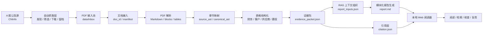

# IPO Evidence Intelligence

IPO Evidence Intelligence 是一个面向招股说明书的证据型智能解读系统。它覆盖了从 A 股招股书自动抓取、PDF 解析、文档资产化、证据抽取、RAG 式内容组织、报告生成，到本地 Web 阅读与 citation 核查的完整流程。

这个项目不是简单的“把 PDF 丢给大模型总结”。它的核心设计目标是：让 AI 输出的每一个关键判断，都能回到原始招股说明书中的具体页码、文本块、章节路径或表格字段，从架构上降低幻觉率，提高研究结论的可追溯性。

> 项目用途：个人研究、招股书阅读、证据组织、AI 文档处理实验。
> 非用途：投资建议、交易推荐、法律意见或财务审计结论。

## 项目定位

招股说明书通常有几百页，包含正文、章节层级、财务表格、客户供应商数据、募投信息、风险因素等内容。直接让大模型读取整本 PDF，容易出现三个问题：

- 上下文过长，模型容易遗漏关键信息。
- 表格、图示、页码和章节关系容易丢失。
- 报告看起来完整，但无法判断每个结论来自哪里。

IPO Evidence Intelligence 的解决方式是先把 PDF 变成 AI 可读、可检索、可引用的结构化资产，再基于这些资产生成报告。也就是说，系统先构建“证据层”，再进行“内容生成”。

## 完整流程

当前项目已经形成从数据获取到后续使用的端到端闭环：



这个流程包含三个关键闭环：

- **数据闭环**：自动抓取或手动放入 PDF，统一进入 `data/inbox/`。
- **证据闭环**：PDF 被拆解为 Markdown、文本块、章节树、表格和 evidence packet。
- **使用闭环**：报告、citation 和原文视图在 Web 阅读器中联动，方便边读边核查。

## 架构设计：从源头降低幻觉率

项目架构的核心不是“生成得更像报告”，而是“让生成不能脱离证据”。

```text
原始 PDF
  -> Markdown 正文
  -> 文本块 blocks.jsonl
  -> 章节结构 source_ast.json / canonical_ast.json
  -> 表格结构 tables/*.json
  -> 证据包 evidence_packet.json
  -> 报告输入 report_inputs.json
  -> 报告 report.md
  -> 引用 citation.json
```

这套架构通过以下方式降低幻觉率：

1. **不直接基于整本 PDF 自由生成**

   报告生成器不把整份 PDF 当成一个巨大 prompt 输入，而是从 `evidence_packet.json` 和 `report_inputs.json` 中取材料。生成内容必须经过证据层组织。

2. **事实与表达分离**

   `evidence_packet.json` 保存事实、来源位置和质量状态；`report.md` 只负责表达。这样即使报告需要重写，也不影响底层证据。

3. **citation 约束**

   文本引用需要包含 `source_file`、`page_number`、`block_id`、`section_path` 和 `quote`。表格引用需要包含 `table_id`、`table_title`、字段值和来源页码。

4. **质量状态显式化**

   系统使用 `safe_to_use`、`manual_review`、`do_not_use` 三档质量状态。解析失败、章节不完整、表格质量低或引用不足时，不会被包装成“看起来完成”的报告。

5. **模块边界清晰**

   抓取层、解析层、证据层、生成层和 Web 层相互解耦。任何一层出现问题，都可以定位、替换或复查，不会把错误一路静默传递到最终报告。

## 招股说明书处理方式

招股说明书不是普通文章 PDF。它既有长文本，也有目录、页码、复杂表格、风险章节、财务数据和业务描述。项目在设计上参考了国外文档智能项目中常见的 PDF-to-Markdown / layout-aware processing 思路：先把 PDF 拆成 AI 更容易读取的中间语言，再对不同内容类型分别处理。

### 1. PDF 转为 Markdown 与文本块

系统先将 PDF 内容转成 Markdown 正文，并拆分为带页码、块 ID 和章节路径的文本块：

```text
document.md
blocks.jsonl
parse_report.json
```

这样做的意义是：Markdown 适合大模型读取，`blocks.jsonl` 适合检索、定位和 citation。

### 2. 章节结构单独建模

系统会生成两类章节结构：

```text
source_ast.json
canonical_ast.json
```

`source_ast.json` 尽量保留原招股书章节结构；`canonical_ast.json` 则将不同公司、不同文件中的章节映射到统一研究口径，例如业务与产品、行业、财务、募投、风险等。

### 3. 图表和表格分开处理

表格不会被简单混进正文，而是进入独立的结构化目录：

```text
tables/
  T-001.json
  T-002.json
```

每张表保留标题、页码、章节路径、列名、行数据和质量评分。这样财务数据、客户供应商、研发费用、募投项目等信息可以作为结构化证据参与后续分析。

### 4. 形成长期文档资产

每份招股书最终形成一个可复用的文档包：

```text
data/docs/{doc_id}/
  manifest.json
  document.md
  blocks.jsonl
  source_ast.json
  canonical_ast.json
  tables/
  evidence_packet.json
  report_inputs.json
  report.md
  citation.json
  parse_report.json
  web_index.json
```

PDF 只是输入材料，真正长期保存和复用的是这些 AI 可读、可检索、可核查的文档资产。

## 内容生成与拓展性

项目的内容生成不是单一 prompt 输出，而是经过处理、组织和模块化设计后的生成流程。

### 模块化生成

当前报告生成链路是：

```text
evidence_packet.json
  -> report_inputs.json
  -> report.md
  -> citation.json
```

`evidence_packet.json` 负责保存可引用事实，`report_inputs.json` 负责组织分析视角，`report.md` 负责最终表达，`citation.json` 负责来源核查。这个结构使报告生成可以被替换、扩展或重写，而不破坏底层证据资产。

### 多 Prompt 与 Skills 拓展空间

项目把写作规则、报告视角和生成约束放在配置层，例如：

```text
configs/report_prompt.yaml
```

这意味着后续可以接入多套 Prompt 或 Skills，针对不同分析目标生成不同类型的内容：

- 公司基本面解读
- 行业与竞争格局分析
- 财务质量分析
- 募投项目分析
- 风险因素提取
- 个人投资视角报告
- 认知与商业模式视角报告
- 多公司横向对比

由于底层 evidence packet 已经统一，新增分析模块时不需要重新设计 PDF 解析流程，只需要新增 prompt、skill 或生成策略。

### RAG 能力

项目天然具备较强的检索增强生成能力。原因是它已经把原始 PDF 拆成了适合检索和引用的结构：

- `blocks.jsonl`：可作为文本块检索基础。
- `canonical_ast.json`：可按统一章节语义筛选上下文。
- `tables/*.json`：可作为结构化表格证据。
- `evidence_packet.json`：可作为高质量候选证据集合。
- `citation.json`：可把生成结果反查回原文位置。

这使系统可以从“整本 PDF 一次性总结”升级为“按问题检索证据，再基于证据生成回答”的 RAG 工作流。

## 自动抓取层

项目包含 A 股招股说明书自动抓取前置层：

```text
src/ipo_evidence/source_sync/
  client.py
  filters.py
  downloader.py
  state.py
  service.py
  cli.py
```

它负责：

- 从披露源发现候选招股说明书。
- 过滤提示性公告、摘要、问询回复、法律意见书等非正文文件。
- 下载允许进入主链路的 PDF。
- 写入 discovery、filter、download 和 sync state 日志。
- 保留公告 ID、来源 URL、本地路径、文件哈希、披露阶段和 OCR 状态等边界字段。

自动抓取层不会直接修改证据包或报告。它只把合格 PDF 放入 `data/inbox/`，后续继续走统一处理链路。

## 本地 Web 阅读器

项目包含一个本地 Vite React 阅读器，负责后续使用：

- 查看文档列表。
- 阅读生成后的长版报告。
- 点击 citation 查看来源页码、文本块、表格字段和原文摘要。
- 在报告与原始 Markdown 之间切换核查。

Web 阅读器不是临时生成器，而是预生成资产的阅读和验证界面。这样可以避免打开页面时才临时调用模型，也更适合对报告进行复查和沉淀。

## 技术栈

- Python 3.11+
- Pydantic
- PyYAML
- Requests
- Vite
- React
- TypeScript
- Vitest
- Pytest

## 快速开始

安装 Python 依赖：

```powershell
python -m pip install -e ".[dev]"
```

安装前端依赖：

```powershell
npm install --prefix web
```

将招股书 PDF 放入：

```text
data/inbox/
```

运行本地处理链路：

```powershell
python -m ipo_evidence.cli scan-inbox
python -m ipo_evidence.cli run --limit 3
```

重新生成已有文档包的报告：

```powershell
python -m ipo_evidence.cli generate-report --doc-id <doc_id>
```

运行 A 股抓取前置层：

```powershell
python -m ipo_evidence.source_sync.cli sync-a-share --days 7 --limit 3
```

启动 Web 阅读器：

```powershell
npm run web:dev
```

构建 Web 应用：

```powershell
npm run web:build
```

## 验证

后端测试：

```powershell
python -m pytest -q
```

前端测试：

```powershell
npm --prefix web run test
```

前端构建：

```powershell
npm --prefix web run build
```

小规模本地链路验证：

```powershell
python -m ipo_evidence.cli run --limit 1
```

## 当前状态

当前项目已经覆盖完整主流程：

- A 股招股书自动抓取入口。
- 本地 PDF 输入池。
- PDF 解析与文档资产化。
- Markdown、blocks、章节树与结构化表格产出。
- evidence packet 构建。
- RAG 上下文组织。
- 模块化报告生成。
- citation 反查。
- 本地 Web 阅读与核查。

后续可以继续扩展：

- 港股招股书兼容。
- 多公司横向比较。
- 版本 diff。
- 股权结构图和组织结构图抽取。
- 更复杂的检索层和向量索引。
- 更多 Prompt、Skills 和分析模板。

## 免责声明

本项目用于个人研究、学习和证据组织。生成内容不构成投资建议、交易建议、法律意见或审计结论。
