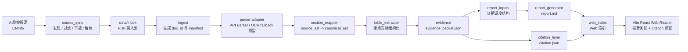

# IPO Evidence Intelligence

IPO Evidence Intelligence 是一个面向个人研究的招股书证据型解读系统。它的核心目标不是“快速总结一份 PDF”，而是把招股书解析成可复查、可引用、可长期保存的本地文档资产，再生成带 citation 的研究报告，并在本地 Web 阅读器里完成阅读和证据核查。

当前项目处在第二阶段前半段：第一阶段的本地 PDF 证据闭环已经跑通；当前新增的是 A 股招股书自动抓取前置层，并保持它与后续 OCR、证据包、报告生成和 Web 阅读器解耦。

## 项目架构

整体架构分为四层：抓取前置层、文档处理链路、证据报告层、本地阅读层。



### 后端处理链路

后端位于 `src/ipo_evidence/`，以 Python 为主：

- `source_sync/`：A 股披露源同步前置层，负责候选发现、正文过滤、下载、去重和状态日志，不触发 OCR。
- `ingest.py`：扫描 `data/inbox/`，为 PDF 建立文档包和初始 `manifest.json`。
- `parser/`：统一 Parser 接口，当前有 API stub 和 `PaddleOCRVLParser` 适配位置，业务逻辑不直接依赖某个 OCR 原始返回。
- `section_mapper.py`：把正文块组织成 `source_ast.json`，再映射到统一的 `canonical_ast.json`。
- `table_extractor.py`：抽取收入、客户、供应商、研发、募投、财务等重点表格。
- `evidence.py`：从文本块和表格生成 `evidence_packet.json`，作为报告生成的唯一主入口。
- `report_inputs.py` 和 `report_generator.py`：把 evidence 组织成报告视角并生成 `report.md`。
- `citation_layer.py`：生成 `citation.json`，保证报告引用能回到本地 PDF 定位字段。
- `web_index.py`：为 Web 阅读器生成文档列表索引。

### 前端阅读器

前端位于 `web/`，使用 Vite React：

- `DocumentList`：查看可阅读、需复核或失败的文档包。
- `ReportReader`：把预生成的 `report.md` 渲染成连续长文阅读视图。
- `CitationDrawer`：点击正文里的 citation 后，以右侧抽屉方式展示引用摘要和定位信息。
- `SourceView`：展示 citation 对应的最小来源定位字段，辅助回到 PDF 原文核查。

Web 层只读取本地文档资产，不参与解析和报告生成，避免打开页面时临时生成报告。

### 数据资产结构

每份招股书处理后形成一个长期文档包：

```text
data/docs/{doc_id}/
  manifest.json
  document.md
  blocks.jsonl
  source_ast.json
  canonical_ast.json
  tables/
    T-001.json
  evidence_packet.json
  report_inputs.json
  report.md
  citation.json
  parse_report.json
  web_index.json
```

`data/inbox/` 是进入主处理链路的 PDF 输入池，系统不自动删除这里的文件。`data/tmp/source_sync/` 保存抓取发现、过滤、下载和同步状态日志，便于后续回捞与调规则。

## 项目亮点

1. **证据闭环优先**

   报告中的核心判断必须来自 `evidence_packet.json`，并通过 `citation.json` 回到本地来源定位。文本引用要求包含 `source_file`、`page_number`、`block_id`、`section_path` 和 `quote`；表格引用要求包含 `table_id`、`table_title`、非空字段值和来源页码。

2. **PDF 不是终点，文档资产才是终点**

   招股书 PDF 被视为输入材料，长期资产是 Markdown、JSON、JSONL 和结构化表格。这样后续可以复用同一份资产做报告重生成、Web 阅读、横向比较或质量复查。

3. **抓取层与 OCR / 报告层解耦**

   `source_sync` 只负责发现、筛选、下载和留档，不直接改 evidence、report 或 Web。这样 A 股真实抓取可以独立联调，也不会破坏已经跑通的本地 PDF 链路。

4. **可配置的过滤规则**

   A 股抓取不使用粗暴行业黑名单，而是通过 `configs/filter_rules.yaml` 做窄规则判断，并把被过滤样本写入日志，保留回捞空间。

5. **质量状态显式化**

   项目统一使用 `safe_to_use`、`manual_review`、`do_not_use` 三档质量状态。解析失败、引用不足、表格质量低或章节结构不完整时，应明确记录，不生成看似完成但不可核查的报告。

6. **本地优先、低依赖、可审计**

   当前阶段使用本地文件系统和 JSON/JSONL，不引入数据库、账号系统或云端部署。每一步产物都能直接打开检查，适合个人研究和迭代。

## 项目设计

### 组织设计

项目按“流程边界”而不是按技术类型组织：

```text
configs/        可调整规则与 prompt 配置
data/inbox/     PDF 输入池
data/docs/      长期文档资产
data/tmp/       可重建状态、缓存与抓取日志
src/            Python 处理链路
web/            本地 React 阅读器
tests/          后端与前端关键行为测试
docs/           产品说明、阶段设计与计划
runs/           日志和评估输出
```

这种组织方式让每个目录都有清晰生命周期：输入、临时状态、长期资产、处理代码、阅读界面、设计文档彼此分离。

### 处理链路设计

主链路遵循“先资产化，再写报告”的顺序：

```text
PDF
  -> document.md / blocks.jsonl
  -> source_ast.json / canonical_ast.json
  -> tables/*.json
  -> evidence_packet.json
  -> report_inputs.json
  -> report.md + citation.json
  -> web_index.json
```

设计重点是把“事实来源”和“表达结果”分开：`evidence_packet.json` 负责事实与定位，`report_inputs.json` 负责组织视角，`report.md` 只是最终阅读产物。

### 报告设计

当前报告生成采用确定性模板，不直接把整本 Markdown 交给模型自由发挥。报告方向和写作约束集中在 `configs/report_prompt.yaml`，目前组织为三个阅读视角：

- 公司介绍与行业概况
- 个人投资视角
- 认知世界的方式

如果后续接入 LLM，推荐继续保持这个边界：配置负责写作规则，`report_inputs.json` 负责证据调度，生成器负责组合，而不是让模型绕过 citation 直接输出事实判断。

### 抓取设计

A 股抓取层的目标是“小规模真实联调”，不是高频资讯流。它使用低频、低并发方式发现候选，过滤非正文公告，并下载允许样本到 `data/inbox/`。同步状态记录包括公告 ID、来源 URL、本地 PDF 路径、文件哈希、披露阶段和 `ocr_status`，为后续 OCR 任务流预留边界字段。

### Web 设计

Web 阅读器强调连续阅读和随手核查：

- 正文阅读在主区域完成。
- citation 默认收起，点击正文里的引用标签后，再以右侧抽屉方式展开。
- 原文片段用于快速核对来源。
- 报告必须预生成，Web 不承担临时生成职责。

## 快速开始

安装 Python 开发依赖：

```powershell
python -m pip install -e ".[dev]"
```

运行本地 PDF 处理链路：

```powershell
python -m ipo_evidence.cli scan-inbox
python -m ipo_evidence.cli run --limit 3
python -m ipo_evidence.cli generate-report --doc-id <doc_id>
```

运行 A 股抓取前置层：

```powershell
python -m ipo_evidence.source_sync.cli sync-a-share --days 7 --limit 3
```

运行 Web 阅读器：

```powershell
npm install --prefix web
npm run web:dev
npm run web:build
```

## 验证命令

常用验证：

```powershell
python -m pytest -q
npm --prefix web run test
npm --prefix web run build
python -m ipo_evidence.cli run --limit 1
```

当前设计阶段的最小验证：

```powershell
git status --short
```

## 当前范围

已保留并维护：

- 本地 PDF 文件夹输入。
- A 股招股书样本。
- API 优先的 Parser 适配层和本地 OCR fallback 预留。
- Markdown、blocks、source AST、canonical AST。
- 重点表格结构化。
- evidence packet。
- `report.md` 和 `citation.json`。
- 最小 Web 报告阅读页和 citation 面板。

当前新增：

- A 股招股书自动抓取前置层。
- 自动抓取过滤规则、观察池记录和状态留档。
- 抓取层与 OCR API 对接边界字段。
- 少量真实样本的抓取联调入口。
- 基于 `reader_bundle.json` 的真实文档包阅读流。
- 连续长文阅读 + 引用抽屉的沉浸式阅读模式。

暂缓事项：

- 高频定时抓取和复杂调度。
- 港股 OCR 口径合并与后处理兼容。
- 股权结构图自动抽取。
- 多公司横向对比。
- 版本 diff。
- 复杂图谱探索。
