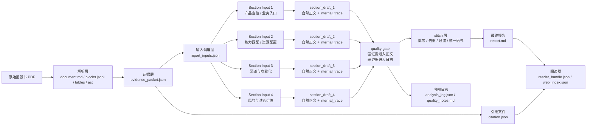

# Report Generation Architecture Proposal

这份文档用于沉淀招股书解读层的目标架构。它只描述 `report_inputs`、prompt、skills、section generation、stitch、analysis log 之间的边界，不修改现有运行链路。

目标是让最终 `report.md` 成为一篇完整、自然、口出有凭的文章；证据不足、字段缺失、外部信息缺口、值得后续优化的问题进入内部日志，不进入最终报告正文。

## 1. 核心原则

### 1.1 最终报告只呈现完成度高的内容

每个 section 生成前先检查证据强度。证据能支撑完整判断时，生成独立段落；证据只能支撑局部事实时，合并进相关段落；证据不足时，只写入 `analysis_log.json` 或 `quality_notes.md`。

最终 `report.md` 不显示“这里缺失信息”这类占位表达，也不为了凑齐结构而硬写空段。

### 1.2 report_inputs 是调度契约

`report_inputs.json` 不承载完整正文证据，只负责调度：

```yaml
section_key: product_positioning
title: 产品定位与真实需求
prompt_slot: narrative_section
skill_refs:
  - business_goal_decompose
  - capability_match
source_sections:
  - about_company
  - business_and_product
  - financials
evidence_refs:
  - evidence_id: E-001
    role: primary
    rank: 1
token_budget: 1800
evidence_policy:
  min_fact_count: 2
  min_strength: medium
  weak_evidence: merge_into_related_section
  no_evidence: log_only
output_contract:
  shape: narrative_section
  requires:
    - core_claim
    - evidence_chain
    - reader_value
```

这一层负责声明“当前段落调用哪些证据、哪些 skill、哪个 prompt、证据不足时如何处理”。

### 1.3 skills 是解读动作，不是大段写作模板

skill 表达稳定动作，例如：

```text
business_goal_decompose     业务目标拆解
capability_match            能力匹配
disclosure_gap_scan         披露缺口识别
reader_value_translate      读者价值翻译
tension_expand              矛盾张力展开
```

行业方法论通过 profile 提供关注字段，而不是为每个行业复制一大套 skills。

### 1.4 prompt 是单段写作规则

prompt 负责当前 section 的写法、语气、citation 规则、篇幅和输出格式。它不承担所有方法论，也不一次性吃完整招股书。

### 1.5 stitch 层只做文章整合

stitch 层读取合格 section draft 和 internal trace，负责排序、去重、过渡、统一语气、删除低完成度内容。它不新增事实判断，不绕过 citation。

## 2. 总体链路



## 3. 生成流程

```text
1. 根据 company_profile 选择 report profile
2. report_inputs 根据 profile 生成 section_groups
3. 每个 section_group 只加载自己的 evidence_refs
4. section_generator 加载当前 skill_refs 和 prompt_slot
5. section_generator 输出 section_draft 与 internal_trace
6. quality_gate 判定 section_draft 的正文去向
7. stitcher 组合合格 section_drafts
8. 最终写入 report.md / citation.json / reader_bundle.json
9. 证据不足和后续优化项写入 analysis_log.json
```

## 4. 耦合边界

### 4.1 强耦合

```text
evidence_packet -> citation
report_inputs -> evidence_refs
section_generator -> skill_refs
report.md -> citation ids
```

这些耦合用于保证“口出有凭”。最终报告中的事实必须能回到 `EvidenceItem`，citation 必须能回到页码、block、table 或字段。

`citation.json` 应继续由 `evidence_packet` 派生，并保持 citation 编号与 evidence 原始顺序一致。section generator 和 stitcher 只能消费、引用或校验 citation，不能重新生成事实定位，也不能改变 citation 编号。

### 4.2 弱耦合

```text
report_inputs -> profile config
section_generator -> prompt_slot
stitcher -> internal_trace
quality_gate -> evidence_policy
```

这些耦合用于调度和质量控制。配置可以替换，主 pipeline 不需要知道具体行业方法论。

### 4.3 解耦

```text
parser 与行业方法论解耦
evidence 构建与最终写作风格解耦
行业 profile 与主 pipeline 解耦
analysis_log 与最终 report 解耦
外部数据接入与基础招股书解析解耦
```

解耦的含义是：解析层只产出可引用证据；消费产品、技术公司、周期行业等方法论通过 profile 和 skills 接入；最终报告只展示成熟内容；内部日志服务后续优化。

## 5. 可扩展部分

### 5.1 Parser 层

可以扩展：

```text
港股招股书 parser
美股 S-1 parser
问询回复 parser
年报 parser
图表抽取
组织结构图抽取
股权结构图抽取
```

Parser 层只负责文档资产化，不绑定具体报告方法论。

### 5.2 Evidence 层

当前 evidence 可以继续扩展类型：

```text
text_quote          原文文本证据
table_fact          表格字段证据
external_fact       外部网页、电商平台、产品评价等证据
calculated_metric   由表格计算出的指标
cross_doc_fact      多版本招股书 diff 结果
visual_fact         图表或结构图抽取结果
```

例如消费产品公司中的“某渠道销量很高但招股书未展开”可以由 `external_fact` 与 `disclosure_gap` 联合表达；最终报告只写证据能支撑的自然判断，未完成核查的部分进入 analysis log。

### 5.3 report_inputs 层

建议在现有字段基础上增加：

```yaml
skill_refs: []
evidence_policy:
  min_fact_count: 2
  min_strength: medium
  weak_evidence: merge_into_related_section
  no_evidence: log_only
output_contract:
  shape: narrative_section
  requires:
    - core_claim
    - evidence_chain
    - reader_value
section_role: main | supporting | optional
```

这一层是未来扩展的主入口。

### 5.4 Skills 层

通用 skills 保持少量稳定：

```text
business_goal_decompose
capability_match
disclosure_gap_scan
reader_value_translate
tension_expand
```

行业 profile 只提供关注字段：

```yaml
consumer_product:
  attention_fields:
    - 产品定位
    - 价格带
    - 渠道结构
    - 平台依赖
    - 销售费用
    - 用户口碑
    - 售后服务
    - 供应链

technology_company:
  attention_fields:
    - 研发人员
    - 核心技术
    - 专利
    - 产品化进度
    - 客户验证
    - 替代风险

cyclical_industry:
  attention_fields:
    - 产能
    - 价格周期
    - 原材料成本
    - 库存
    - 资本开支
    - 行业供需
```

这样每个 section 只加载当前需要的 1-2 个通用 skill 和一个行业 profile 的少量参数。

### 5.5 Prompt 层

prompt 可以拆成：

```text
section_writer.yaml     单段写作
stitch_writer.yaml      全文整合
citation_checker.yaml   引用检查
```

section writer 只负责当前段落，stitch writer 只负责全文自然度和过渡，citation checker 只负责引用完整性。

### 5.6 Quality Gate 层

quality gate 根据 internal trace 判断内容去向：

```text
strong evidence  -> 独立成段
medium evidence  -> 合并进相关段落
weak evidence    -> 写入 analysis_log
no evidence      -> 不生成正文
```

最终 report 保持完整自然；日志记录后续优化方向。

### 5.7 Analysis Log 层

日志建议结构：

```json
{
  "doc_id": "doc_xxx",
  "skipped_or_merged": [
    {
      "section_key": "platform_dependency",
      "reason": "招股书中只有线上销售收入，缺少平台拆分数据",
      "needed_evidence": [
        "主要电商平台销售额",
        "平台店铺销量",
        "销售费用投放结构"
      ],
      "suggested_next_step": "接入外部电商数据或人工补充 external_fact"
    }
  ]
}
```

analysis log 服务系统迭代，不进入最终阅读报告。

## 6. 推荐目录结构

```text
configs/
  report_profiles/
    base.yaml
    consumer_product.yaml
    technology_company.yaml
    cyclical_industry.yaml

  skills/
    business_goal_decompose.yaml
    capability_match.yaml
    disclosure_gap_scan.yaml
    reader_value_translate.yaml
    tension_expand.yaml

  prompts/
    section_writer.yaml
    stitch_writer.yaml
    citation_checker.yaml

src/ipo_evidence/
  report_inputs.py
  section_generator.py
  report_stitcher.py
  quality_gate.py
  analysis_log.py
  report_generator.py
```

`report_generator.py` 最终可以变薄，只负责编排：

```text
load report_inputs
run section_generator
run quality_gate
run stitcher
write report.md
write analysis_log.json
write citation.json
write reader_bundle.json
```

## 7. 消费产品公司解读包的抽象

消费产品公司 profile 关注的核心不是公司是否值得被夸，而是公司的产品、渠道、营销、供应链、售后和用户口碑如何共同支撑增长叙事。

可生成的 section 示例：

```text
产品定位与真实需求
能力结构与资源配置
渠道真实度与平台依赖
营销调性与费用效率
风险约束与售后压力
不同读者的可用结论
```

每个 section 按自己的 evidence_refs 生成，完成度不足的 section 进入日志或合并，不在最终报告中留下空洞模块。

## 8. 当前 PR 的定位

这份 PR 是设计提案，不改变运行逻辑。后续实现可以拆成小 PR：

```text
PR 1: 扩展 report_inputs schema
PR 2: 新增 section_generator 和 internal_trace
PR 3: 新增 quality_gate 和 analysis_log
PR 4: 新增 stitcher
PR 5: 新增 consumer_product profile
```

每个 PR 都可以单独验证，避免一次性引入过重架构。
